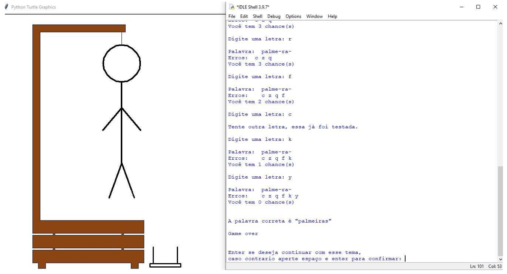

# Hangman with Turtle Graphics (Forca)


## 📋 Project Overview

This is an interactive **Hangman Game** that combines classic logic with real-time graphical rendering. Unlike simple text-based versions, this project uses Python's **Turtle Library** to draw the gallows, the character, and animations step-by-step as the player guesses.

**Engineering Highlight:**
The application features a hybrid interface:
1.  **Backend Logic:** Handles input validation, word randomization (5 themes), and win/loss states.
2.  **Graphical Frontend:** Uses `turtle` to render vector graphics dynamically. It includes a custom **physics simulation** for the "Game Over" sequence (the bench falling).

## 📸 Gameplay Preview

<div align="center">
  
  <p><i>Figure: The "Game Over" screen (Player Loss). Note the fully drawn character and the bench kicked over by the physics engine.</i></p>
</div>

## 🚀 Key Features

* **Dynamic Drawing:** The stick figure is drawn limb-by-limb in real-time upon incorrect guesses.
* **Physics Animation:** If the player loses, the system triggers an animation where the stool/bench is kicked over.
* **Themed Word Banks:** Players can choose from 5 distinct categories (Animals, Objects, Fruits, etc.) to tailor the difficulty.
* **Input Sanitization:** Robust handling of user inputs to prevent crashes or invalid characters.

## 🛠️ Tech Stack

* **Language:** Python 3
* **Graphics Engine:** `turtle` (Standard Python Library)
* **Utilities:** `random` (for word selection), `os` (for system interactions).

## 💻 How to Run

1.  **Clone the repository:**
    ```bash
    git clone [https://github.com/RafahelMatias/forca-python.git](https://github.com/RafahelMatias/forca-python.git)
    cd forca-python
    ```

2.  **Run the Game:**
    ```bash
    python main.py
    ```

    *(Note: Ensure you have a window manager installed if running on Linux/WSL, as Turtle opens a graphical window).*

---
**Author:** Rafahel Matias
*Software Engineer specializing in Backend Development & Automation.*